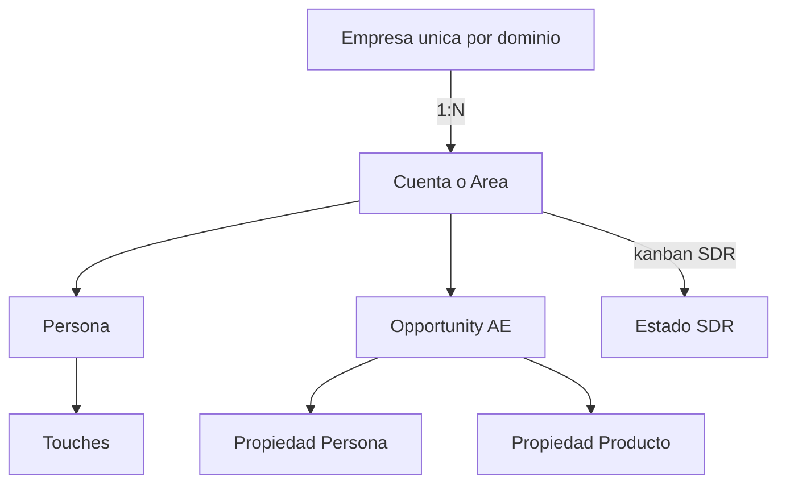

# CRM Sponsors — modelo B2B (Empresa → Cuenta → Persona → Opportunity)

**Fuente:** CRM Sponsors (Daniela Rivera, sep 2026) + decisión de producto CTW.  
**Este documento supersede** el enfoque de “Person como kanban SDR” (PR `#2`) y las etapas genéricas ES de Opportunity (PR `#1`).

## Resumen / Summary

| ES | EN |
|----|----|
| **Empresa (Company)** = maestro único por dominio. Sin kanban SDR. | **Company** = unique master by domain. No SDR kanban. |
| **Cuenta / Área** = tarjeta del kanban Vista SDR (`Estado SDR`). | **Account / Area (Cuenta)** = SDR kanban card (`Estado SDR`). |
| **Persona** = secundaria (`+ contacto` en panel de Cuenta). Touches en Person, ligados a Cuenta. | **Person** = secondary (add contact on Cuenta panel). Touches on Person, linked to Cuenta. |
| **Opportunity** = pipeline AE; debe ligarse a **Cuenta**. Persona + Producto = propiedades del deal. | **Opportunity** = AE pipeline; required link to **Cuenta**. Person + Product = deal properties. |

## Por qué no Person.sdrStage / Why not Person.sdrStage

PR `#2` añadió `sdrStage` + kanban **Vista Pipeline SDR** en **Person**. Eso **no** coincide con el modelo acordado (estilo CTW):

- Una Empresa (p.ej. Oracle) tiene **varias** Cuentas/Áreas con distinto Estado SDR y distinto SDR dueño.
- El contacto no es la unidad del board SDR; la **Cuenta** lo es.
- Dejar `sdrStage` en Person como eje primario lleva a datos incorrectos y vistas confusas.

**En este branch:**

- **No** se mergea el kanban SDR sobre Person.
- Opportunity conserva las etapas **AE Sponsors** (ver abajo).
- **Cuenta** se crea como **objeto custom en UI** (Settings → Data model). No hay rewrite del framework de standard objects en este PR.

Guía operativa UI: ver runbook del Project Context (`runbook-cuenta-ui.md`) o sección “Cuenta en UI” más abajo.

## Opportunity — etapas AE (código en este PR)

Kanban: **Pipeline AE** (`byStage`). Default: `DISCOVERY_DONE`.

| Value | Label ES |
|-------|----------|
| `DISCOVERY_DONE` | Discovery realizada |
| `PROPOSAL_BUILDING` | Propuesta en construcción |
| `PROPOSAL_PRESENTED` | Propuesta presentada |
| `PROPOSAL_REVIEWED` | Propuesta revisada |
| `PROPOSAL_NEGOTIATION` | Propuesta en negociación |
| `COMMITTED` | Committed |
| `WON` | Ganado |
| `LOST` | Perdido |

Relaciones nativas hoy: `company`, `pointOfContact` (Person). La relación **obligatoria a Cuenta** y campos Producto / Persona principal se configuran en el Data model del workspace tras crear el objeto Cuenta (UI), hasta que exista un standard object Cuenta en el fork.

## Cuenta / Área — kanban SDR (UI custom object)

No se introduce un standard object `cuenta` en este PR (evita rewrite amplio del metadata framework). Crear en la instancia:

1. Settings → Data model → **Add object** → **Cuenta** (plural Cuentas).
2. Relation **Empresa** → Company (N:1).
3. Select **Estado SDR**: Por contactar, Contactado, Touch point 2–6, Caliente, Reunión agendada, Reagendar, Unqualified, No interesado, En nutrición (default: Por contactar).
4. Campos: SDR dueño, ICP, Fuente, Size, País, etc.
5. Vista kanban **Vista SDR** agrupada por Estado SDR.
6. Person → relation Belongs to **Cuenta**; Opportunity → relation Belongs to **Cuenta** (required en proceso).
7. Si en algún workspace quedó `Etapa SDR` / `sdrStage` en Person (de PR `#2` o UI manual): **ocultar** de layouts y no usar como kanban primario.

## Relación con PRs previos / Prior PRs

| PR | Branch | Estado respecto a este doc |
|----|--------|----------------------------|
| [#1](https://github.com/juanolaya-ctw/twenty-crm-ct/pull/1) | `cursor/sales-pipeline-es-20ed` | **Superseded / cerrar** — etapas genéricas Nuevo/Calificación/… reemplazadas por lista AE Sponsors. |
| [#2](https://github.com/juanolaya-ctw/twenty-crm-ct/pull/2) | `cursor/sdr-ae-pipeline-8ccb` | **Obsolete as SDR axis** — AE stages se reutilizan aquí; Person `sdrStage` kanban **no** se lleva a `main`. |

## Validación

**Código (Opportunity AE):** reset/provision workspace con este branch → Opportunities → **Pipeline AE**.

**Producto completo (SDR + AE):** además del código, ejecutar setup Cuenta en UI en `:3000` (objeto + Vista SDR + relations).

Workspaces existentes no reciben opciones nuevas solo por deploy; hace falta reset, upgrade command, o edición manual en Data model.
